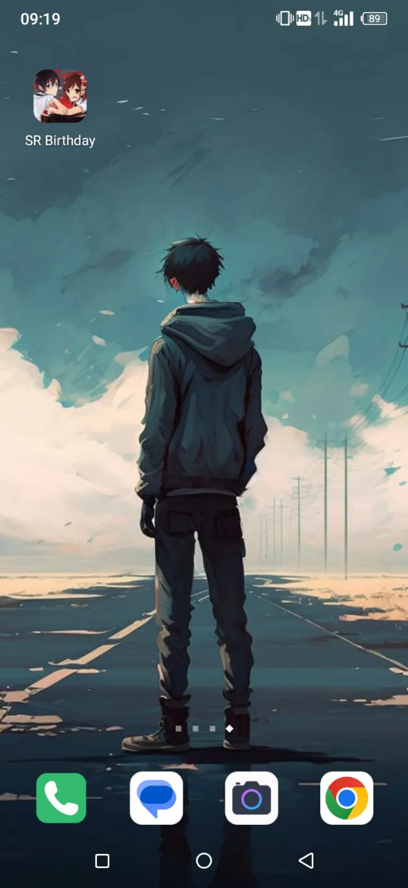
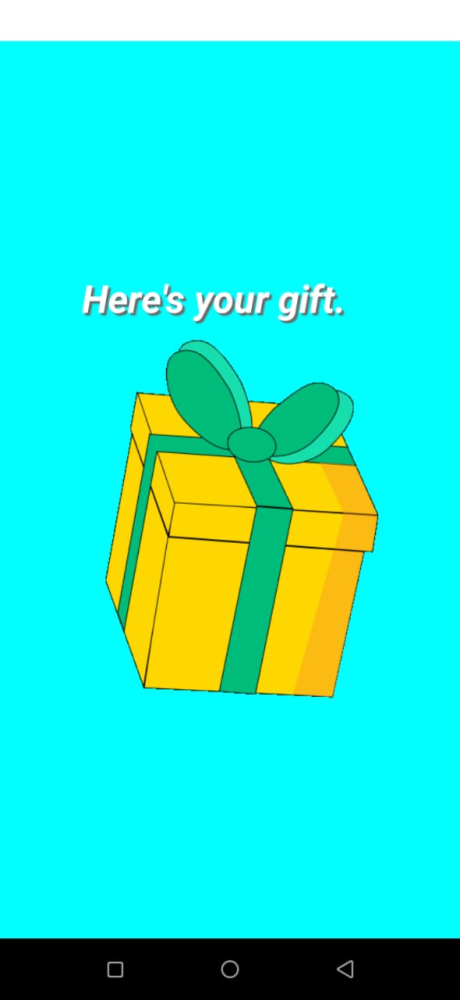
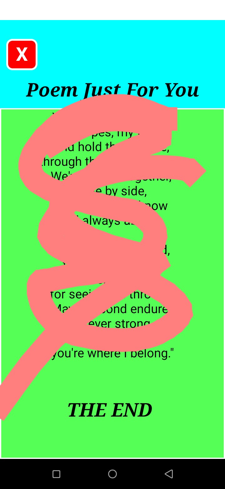
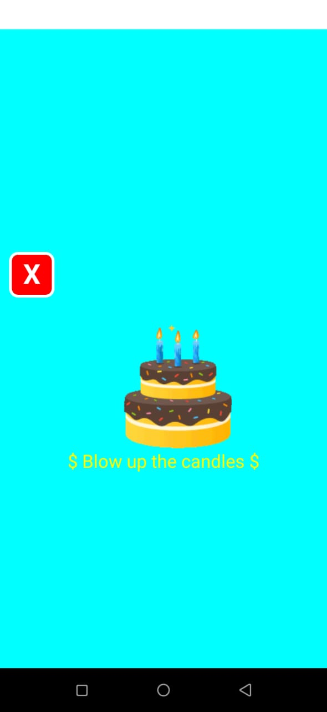
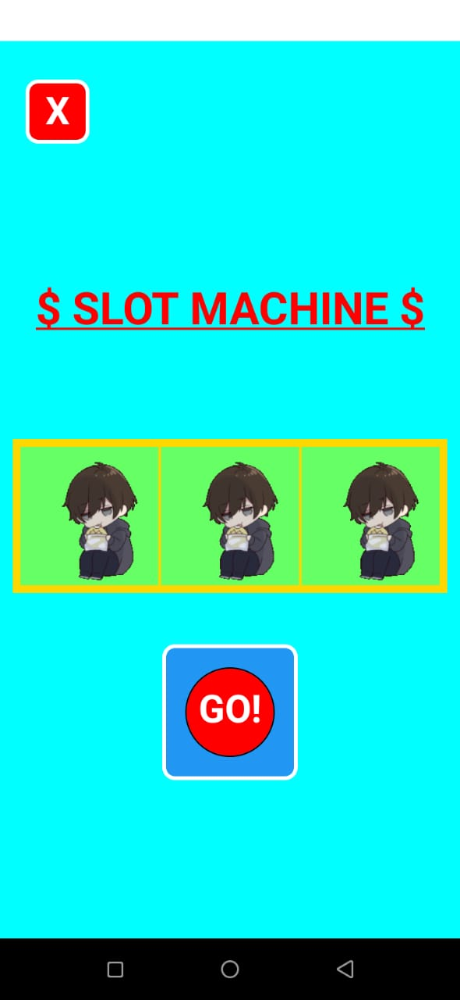

# HappyBirthday-ExpoReactNative

A simple android app built using <strong>Expo</strong> and <strong>React Native</strong>.

 

 Android apk can be found at <italic>/apk/SR-Birthday.apk</italic>

 

# Demo

<ul>

<li><h2>Android app Icon with name SR Birthday.</h2></li>

  
<li><h2>Starting Page.</h2></li>

  
<li><h2>Surprise Page with wishing board and firework at back.</h2></li>

  
<li><h2>Futher options to proceed.</h2></li>

  
<li><h2>First Option says a Poem for whoever that is for.</h2></li>

  
<li><h2>Second Option says to blow up the candles, and further is more surprise.</h2></li>

  
<li><h2>Third Option is a mini game, Slot machine.</h2></li>

</ul>